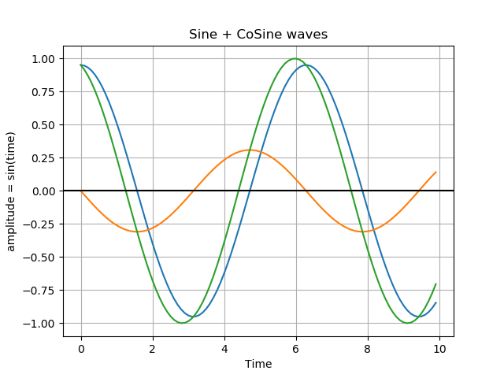
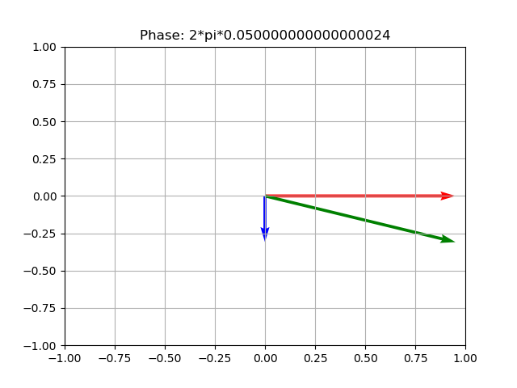
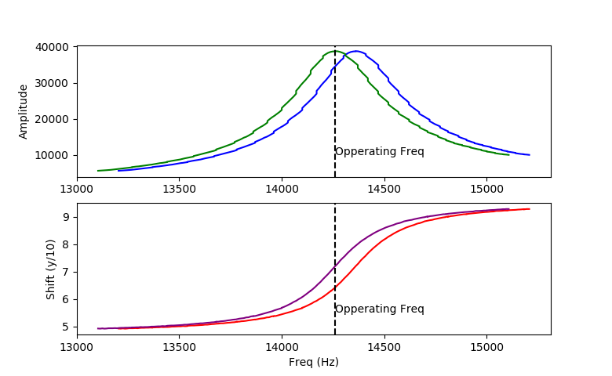

# Design Issues of the OpenEM

The following is a brief statement explaining issues that have arisen during my research into designing the OpenEM; a Low-Cost EMI sensor.

## Intro

The basic idea of electromagnetic induction (EMI) frequency domain (FD) sensors is that a sinusoidal current is introduced into a coil that produces a magnetic field (Ampere's Law) whose magnitude is sinusoidal and therefore produces an electric field (maxwell-faraday equation) that causes eddy currents to be induced in nearby mediums (due to the electromotive force and the electrical resistance of medium). These sinusoidal eddy currents produce a secondary magnetic field that precedes the first (primary) magnetic field by 90 degrees and is said to be in quadrature. Both changing magnetic fields induce an electromotive force (measured in volts) in a second coil (receiver coil) which forms the basis of the input signal.

_Image 1: sine waves of the primary (green) and secondary (orange) signals_

_Image 2: vectors of the primary (red) and secondary (purple) signals_

The input signal is then separated into the primary wave and the secondary wave via quadrature demodulation. The secondary wave is used to calculate the apparent electrical conductivity (ECa) via McNeil's equation and will be inversely proportional to the electrical resistivity of the nearby medium. Changes in the primary wave are proportional to changes in the magnetic susceptibility of the nearby medium; as the relative permeability of the medium impacts the magnetic field. The 'depth of penetration', which is an estimate of the average depth of the origins of the secondary magnetic field, is determined by the geometry of both coils in relation to each other and the nearby medium (in our case, the ground). With common configurations (eg; horizontal and vertical dipole) the depth of penetration of proportional to the intercoil spacing (distance between the transmitter and receiver coil).

## Current Setup

I wanted to start with using a vertical dipole configuration as it is the most basic and has been shown to have the largest depth of penetration (0.7*intercoil spacing). For precision agricultural purposes the intercoil spacing is required to be at least 1m to get subsoil measurements. When the intercoil spacing is small, the magnetic field strength at the receiver coil is large, however, when the intercoil spacing is increased, the magnetic field decreases exponentially in relation to the [Biot-Savart Law](Images/bsav.png).

Although electrical signals can be amplified, if they are much lower than electrical noise (environmental and instrumental) techniques must be employed to overcome the low signal to noise ratio. I used a range of techniques, including analogue and digital filter, using ferrite cores, curve fitting algorithms and operating at the coils resonant frequency. I ran a field survey and got an r2 of 74.5% and concluded that I was on the right track; [see here for results](https://github.com/KipCrossing/EMI_Field).

## Issues and Theorizing

The problems started to arise when changes in temperature would directly affect the outputs (problem 1). Although this can be expected, the variations were large and irregular. My theory is that the variations in temperature change the permeability of the ferrite coil core. This change in permeability affects the induction of the coil which in turn affects the resonant frequency of the coil. Therefore, the magnitude of the input signal may increase or decrease depending on whether the resonant frequency is higher or lower than the operating frequency. A temperature sensor was placed near the receiver coil in an attempt to identify a relationship between the change in temperature and the variations in input signal magnitude. During data collection, I noticed that the reading would change simply by being near the OpenEM or if the OpenEM was near plants. After months of investigation, I concluded that it was due to an electrical field that is present due to an electrical potential of the Transmitter coil, as the varies from peak to peak, and the grounded receiver coil (problem 2). As the OpenEM passes close by plants, the electric field lines are redirected through the plants as they have a higher permittivity than air. In an attempt to stop presence of the electric field, I created Faraday cages to surround each coil. Now, when placed near organic matter (plants, trees), there are no variations. I continued to work on the temperature problem.

It was found that for the relationship between temperature and input signal magnitude to be found, a large amount of data is required; [see here](/Testing/).

Due to the complex relationship between temperature and input signal magnitude, a model was extremely difficult to be established. I had a chat with a professor from the physics department who suggested that the operating frequency should be far away from the resonant frequency such that the relationship between temperature and the resonant frequency is significantly more linear then operating near the resonant frequency. The problem with this technique is that the signal-to-noise ratio would decrease below practical levels.

Further, during constant temperatures, when low into the ground and the secondary field is extracted via quadrature demodulation, the variations in the secondary field were significantly small; Much smaller than that which is predicted via McNeil's equation. This observation led me to believe that the Faraday cages were insufficient in preventing an electric field between the transmitter and receiver coils. Although the Faraday cages did stop variations in the electric field, they didn't stop the presence of an electric field. Instead, the electric field is redirected through the timber frame, as timber has a permeability 4 to 6 times greater than air.

## Closing Remarks

I'm sure there are more techniques and methods for reducing the electric field strength (ie through the use of dielectric materials), however this is far outside my field of expertise. In order to solve these problems, an in-depth knowledge of the permeability and permittivity of materials and tools to detect electric and magnetic fields are required; both of which I do not have. I would need to start practising a whole new discipline of practical physics.

Lastly, my initial assumptions did not consider the presence of an electric field. Therefore, when designing the transmitter coil, a large number of turns was assumed to be desirable as it is proportional to the magnetic field strength. However, the number of turns is also proportional to the electric field strength. I would have to redesign the transmitter coil to account for this.

Considering the small time frame until the due date of my thesis, the gaps in my knowledge and tooling and realistic potential for further unforeseen challenges, I have decided to discontinue work on this project, put it on the shelf and terminate my PhD.
