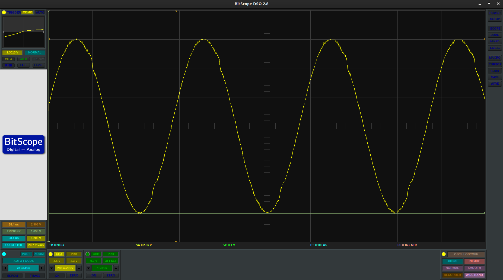
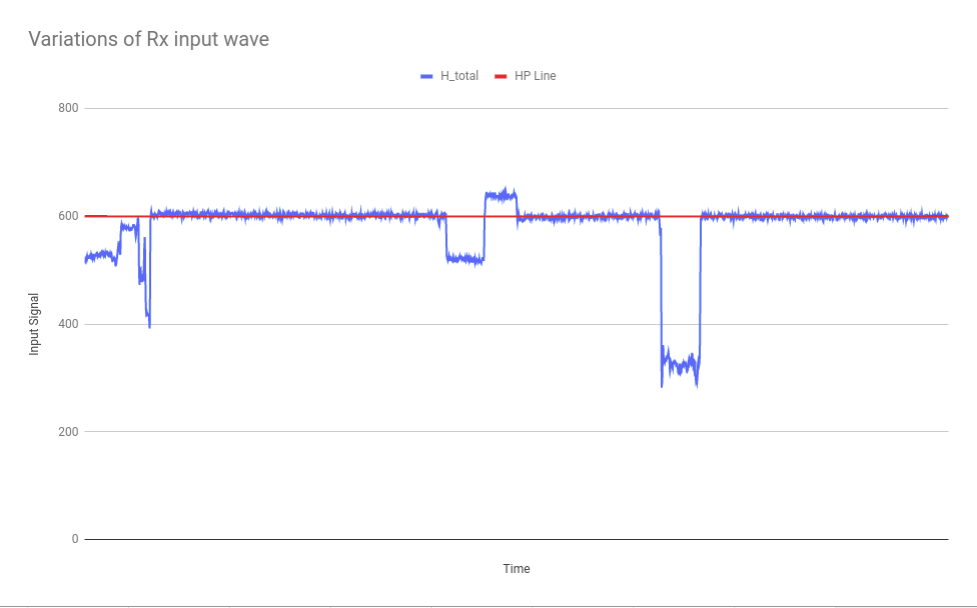

# Powering the Transmitter coil with a H-Bridge

This directory to keep notes on powering the Transmitter with a H-Bridge

The current set up is to keep put chokes on the 12v-in and GND-in lines of The H Bridge.

## Outcomes

- Stable input signal
- No voltage drift
- Small amount of drift (maybe noise)

 _Input wave at calibration location_

 _Graph showing the stability of the input signal_

There seems to be no drift in readings over a long amount of time. The standard deviation is about 2.9 for input reading average of 603.0\. _Note: these readings are directly proportional to the value from the ADC_
