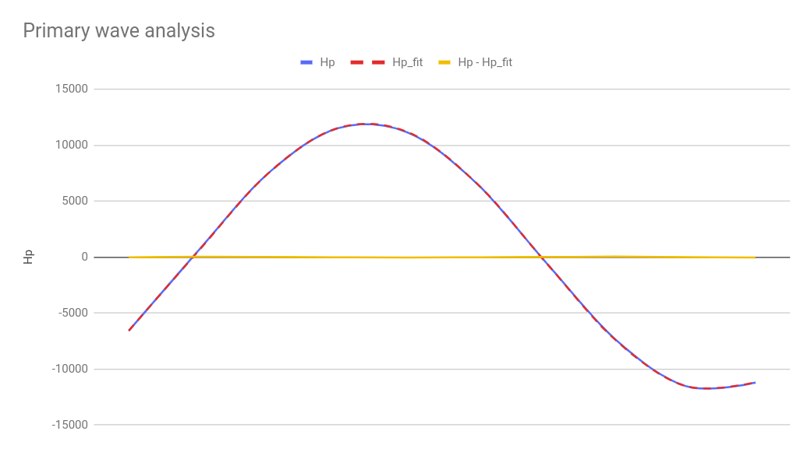
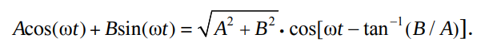

# A discussion on analysing the data containing the primary and secondary waves

In this section, we will discuss approaches used to obtain our primary and secondary waves from our input data.

# Obtaining the Primary wave (Hp)

First, we obtain a list of data that is a representation of the primary wave that was obtained during calibration.

```python
Hp = [-6583,    580,    7477,    11508,    11147,    6558,    -540,    -7415,    -11523,    -11209]
```

We then approximate the Amplitude and phase shift using:

```python
import specialmath
sm = specialmath.SpecialMath()
(amp, sft) = sm.fit_sin(Hp, 5)
```

Note: the shift `sft` is relative to the transmitted wave and is observer by another ADC From these, we can generate a new the "perfect wave" using:

```python
Hp_fit = sm.gen_sin(10, amp, sft)
```

We can now get the values for the "perfect wave":

```python
>>> print(Hp_fit)
[-6570.65308724154, 550.1017952045793, 7460.736489154883, 11521.623425354583, 11181.64181864582, 6570.6530872415415,-550.1017952045727, -7460.736489154878, -11521.623425354584, -11181.641818645821]
```

And by taking the difference of the two lists, we get the noise:

```python
[-12.34691276, 29.8982048, 16.26351085, -13.62342535, -34.64181865, -12.65308724, 10.1017952, 45.73648915, -1.376574645, -27.35818135]
```

By viewing this data on a graph, it may be shown that the difference is relatively minor:



Now, the by subtracting the primary wave data from the input data, we should approximate to zero far away from material. When close to material, input signal

# Obtaining the Secondary wave (Hs)

## Method 1

The values of the Amplitude and Phase shift relative to the Tx signal of Hp are captured during calibration. Then when lowered to the ground for readings, a data list is created using the gen_sin() method that represents the primary wave.

```python
sm.hp = sm.gen_sin(10, sm.hp_amp, s1 + sm.hp_sft)
```

This list is then subtracted from the new input signal list (Ht) to get the list representing the secondary wave.

_Note: this method does not take into account changes in the primary signal_

## Method 2

This method requires only the phase shift (relative to the Tx signal) as a reference to the phase of the primary wave. Once the primary wave phase shift is obtained, during calibration, `sm.hp_sft` the unit vector created using the phase angle is taken to be in parallel with the Real axis on the imaginary plane. As Hs will proceed Hp by a quarter wavelength (quadrature), Hs can be taken a the vector parallel to the imaginary vector.


_(Add lables etc)_

From this, Hp and Hs may easily be extracted from Ht using the trigonometric relationship:

```python
Hs = Ht*np.sin(np.pi*2*phase)
Hp = Ht*np.cos(np.pi*2*phase)
```

Where `phase` is the input phase minus the `sm.hp_sft`.

The above example may be viewed in their sinusoidal form:


The following formula shown the relationship between the two methods.



See [REF](https://dspguru.com/files/Sum_of_Two_Sinusoids.pdf)
